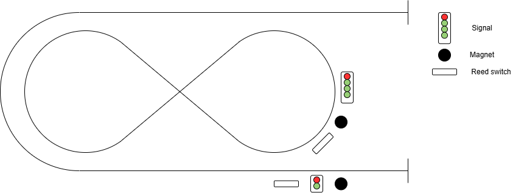
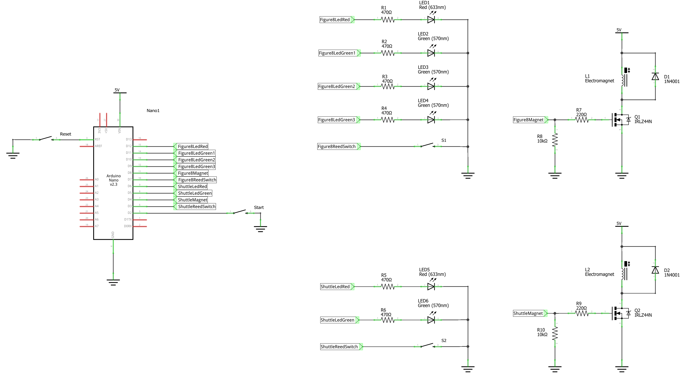
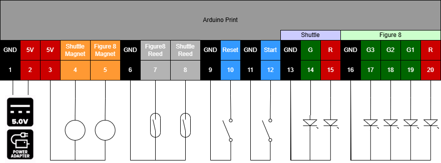

# zeppelin

This project is about a steampunk railway flying around with a zeppelin. The railway consists of figure 8 loop and a U shuttle track. 

## Operation
The shuttle track and the figure 8 share a common rail. Therefor the trains on the shuttle track and the figure 8 loop cannot run simultaneuosly.

The intended operation is that the figure 8 train will complete 4 loops and than stops in order to allow the shuttle train to go back and forth. When the shuttle train is back it stops and the whole sequence repeats endlessly.

The trains are running on battery power. They have a reed switch that can be activated by a magnet. If activated the train will stop. 

Furthermore there is a signal for each of the tracks.
The figure 8 signal "counts" the number of loops the train made.

To control this operation an arduino is used.

## Trackplan

## Schematics

## Connections

