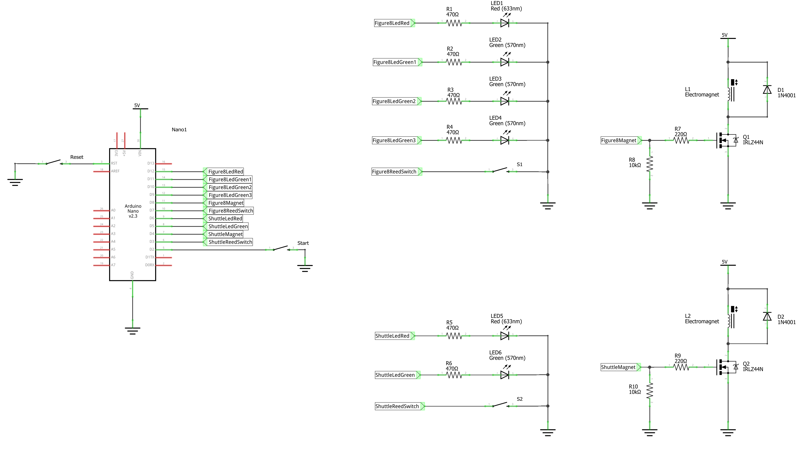
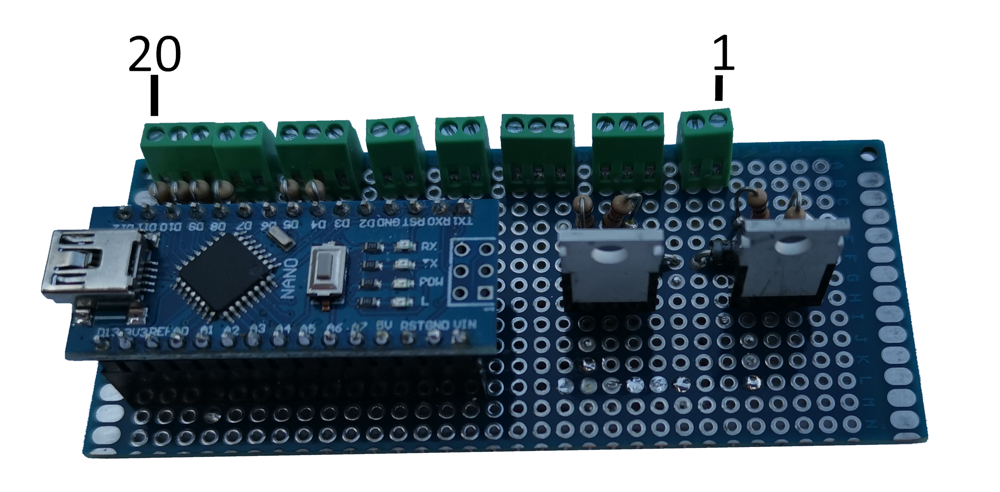
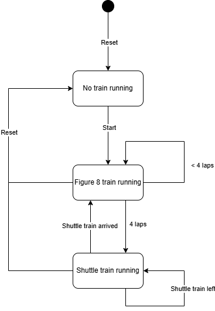

# Steampunk zeppelin

This project is about a steampunk railway flying around with a zeppelin. The railway consists of figure 8 loop and a shuttle track. 

## Operation
The shuttle track and the figure 8 share a common rail. Therefor the trains on the shuttle track and the figure 8 loop cannot run simultaneuosly.

The intended operation is that the figure 8 train will complete 4 loops and than stops in order to allow the shuttle train to go back and forth. When the shuttle train is back it stops and the whole sequence repeats endlessly.

The trains are running on battery power. They have a reed switch that can be activated by a magnet. If activated the train will stop. The train also has a magnet that can activate a reed switch on the track.

Furthermore there is a signal for each of the tracks.
The figure 8 signal "counts" the number of loops the train made.

To control this operation an arduino is used.

## Trackplan

## Schematics
The hart of it all is an arduino Nano. The Nano has enough inputs and outputs to control the leds of the two signals, the two magnets and the two reed switches.

In order to stop the trains a reed switch in the train needs to be activated by a magnet. The magnet is an electromagnet that needs around 300mA to become magnetic.
The IO ports of an arduino cannot deliver that amount of current, therefor the magnets are switched with a MOSFET.

The reed switches and the push button switches all switch between GND and 5V by making use of the internal pull-up resistor.

## The print
All the components are mounted on a circuit board as shown in the foto.

The connections diagram shows how to connect the magnets, leds aand switches.

## Software
The operation of the trains is implemented using a state machine as shown in the diagram.

When the power is connected or the reset button is pressed the software enters the "No trains running" state.
In this state both the magnets are turned on so that the trains stop at the intended location and both signals are red.

When the start button is pressed the software enters the "Figure 8 train running" state. The figure 8 magnet is turned of and the train starts running until it completes four laps. In the meantime, the figure 8 signal shows the number of laps. At four laps the figure 8 train stops and the software enters the "Shuttle train running" state.

In this state the shuttle train magnet is turned of and the signal turns green and the shuttle train can depart.

When the shuttle train arives back at its departure location the shuttle magnet is turned on, the signal becomes red, the train will stop and the software enters the "Figure 8 train running" state.

When the reset button is pressed the software enters the "No train running" state.

## The tools

The following tools are used:
* draw.io for the diagrams
* fritzing for the schematics
* arduino ide for the source code

The diagrams are made in draw.io and are stored as a .png file that also contains the instructions on how the diagram is made. This makes is possible to edit the image with draw.io while it can be shown with any other tools that can show an png image.

Downloading the code to the arduino you need to select to correct bootloader. If the code cannot be downloaded try to select the old boatloader.